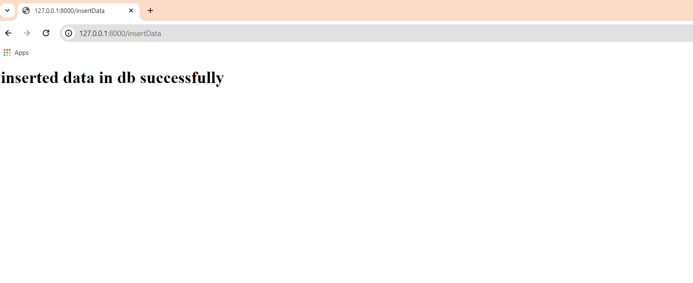
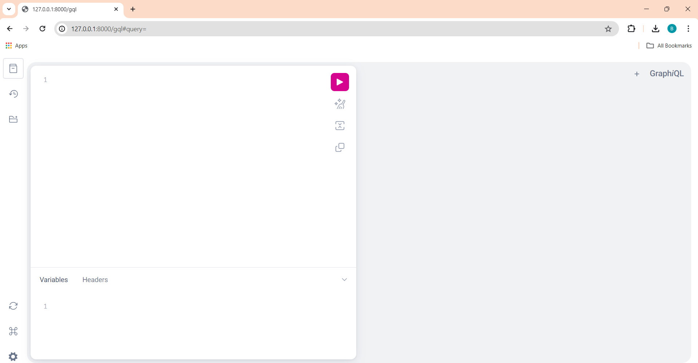
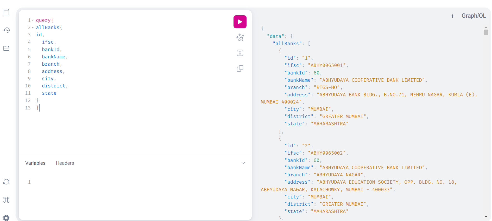
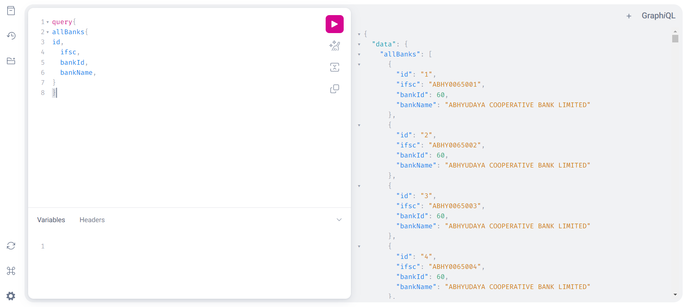
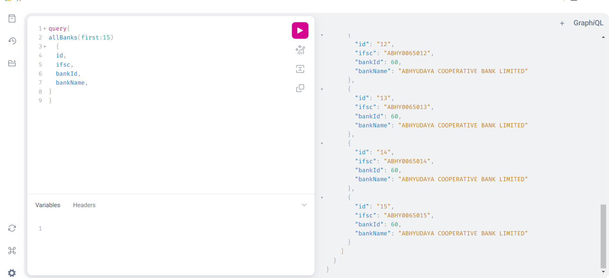
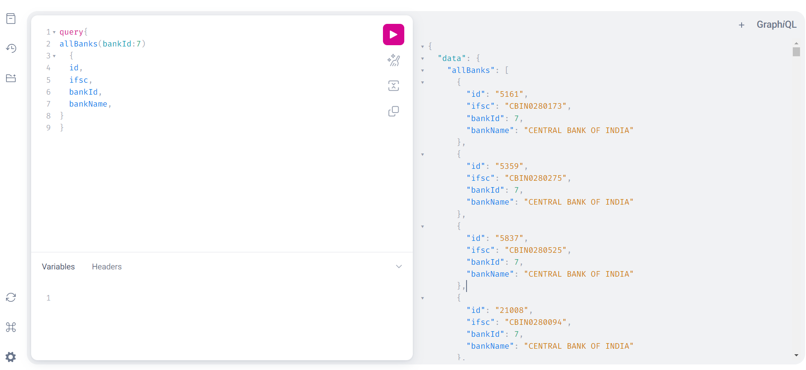
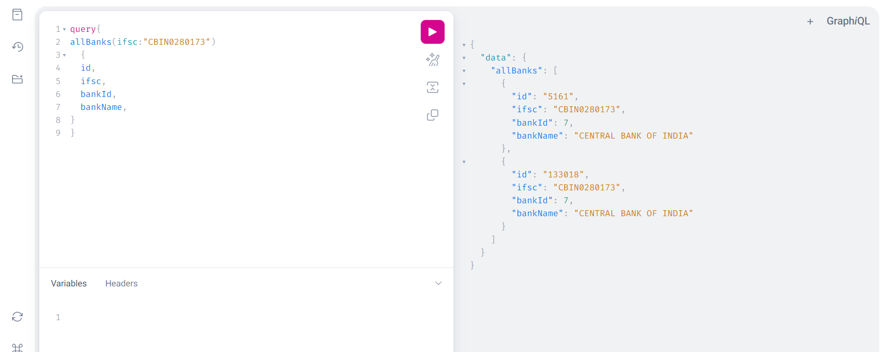
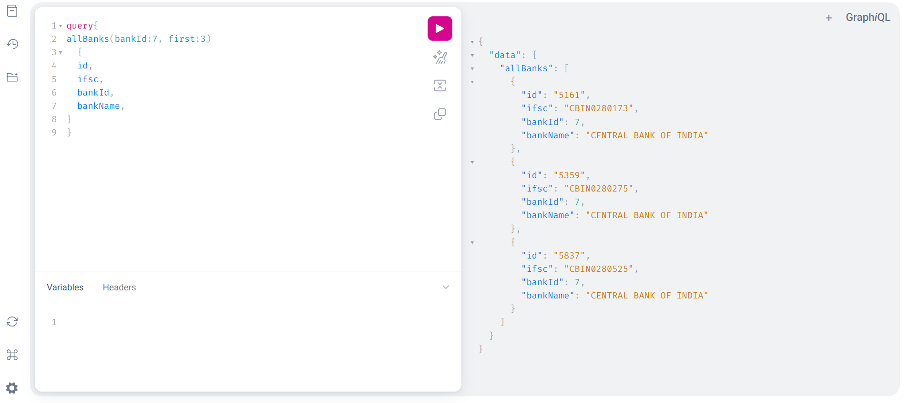
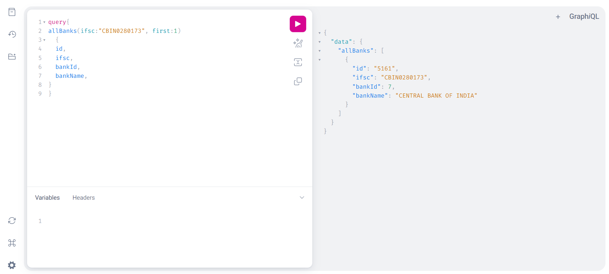

<h1>Task for backend</h1>

<h2> Steps to Run on your local system </h2>

<p>1. clone this repository</p>

```properties
git clone https://github.com/Hemanth-bonala-11/task .
```  

```properties
pip install -r requirements.txt
```  


<p>2. create tables in your database</p>

<p> for windows </p>

```properties
python manage.py makemigrations
```  

```properties
python manage.py migrate
```  

<p> for mac/linux use python3  </p>

```properties
python3 manage.py makemigrations
```  

```properties
python3 manage.py migrate
```  

<p>3. insert data into database </p>

<div> i have created a function to insert data from csv into database which is at /insertData route</div>
<div> hit /insertData route </div>

<div><b> Note : (for first time only)</b> open this url in browser for first time setup</div>

```properties
http://127.0.0.1:8000/insertData
```  





<h2>graphql queries can be done on data at  /gql route </h2>

<div> open this link in browser</div>

```properties
http://127.0.0.1:8000/gql
```  




<h2> Test Cases </h2>

<h3>Arguments </h3>

<div><b>first: </b> Integer </div>
<p> it will return first K records </p>

<div><b>last: </b> Integer </div>
<p> it will return last K records </p>

<div><b>branchId: </b>Integer</div>
<p> it will return all records with that branchId </p>

<div><b>ifsc: </b>Integer</div>
<p> it will return all records with that ifsc </p>

<h3> Test Case1: </h3>
<p> fetch all records </p>


``` properties
query{
allBanks{
id,
  ifsc,
  bankId,
  bankName,
  branch,
  address,
  city,
  district,
  state
}
}
```


<h2> TestCase 2: </h2>

<p> fetch  records with few columns </p>


``` properties
query{
allBanks{
id,
  ifsc,
  bankId,
  bankName,
}
}
```



<h3> TestCase3 </h3>

<p> fetch first few records (eg: 15)  </p>

```properties
query{
allBanks(first:15){
  id,
  ifsc,
  bankId,
  bankName,
}
}

```




<h3> TestCase4 </h3>

<p> filter records based on bankId(eg:7)  </p>

```properties
query{
allBanks(bankId:7)
  {
  id,
  ifsc,
  bankId,
  bankName,
}
}
```




<h3> TestCase5 </h3>

<p> filter records based on ifsc(eg:"CBIN0280173") </p>

```properties
query{
allBanks(ifsc:"CBIN0280173")
  {
  id,
  ifsc,
  bankId,
  bankName,
}
}

```




<h3> TestCase6 </h3>

<p> filter first k number of records based on bankId(eg:7) </p>

```properties
query{
allBanks(bankId:7, first:3)
  {
  id,
  ifsc,
  bankId,
  bankName,
}
}
```




<h3> TestCase7 </h3>

<p> filter first k number of records based on ifsc(eg:"CBIN0280173") </p>


```properties
query{
allBanks(ifsc:"CBIN0280173", first:1)
  {
  id,
  ifsc,
  bankId,
  bankName,
}
}

```

